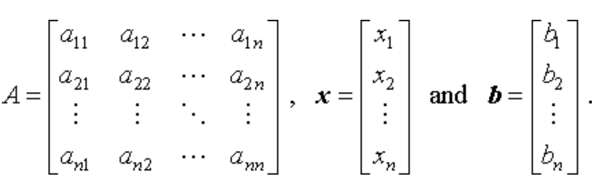

#### Entrada:

- N = Tamaño de matriz A y vector B

---------

#### Problema:

- Ac = B

En la imagen subida por el profesor estaba mal las dimensiones del vecto c, debe ser N x 1
comos se ve reflejado en la imagen inferior con el vector x

---------

#### Variables:

- c = Incognita (cromosoma)

- A = Matriz N x N generada al azar 

- s = Vector generado al azar tamaño N

- B = Multiplicación Matriz A por Vector s
  - B = As

---------

#### Solución:

- La solucion al problema es "s"

- El algoritmo tendrá que averiguar la solución "c"

- cuando c = s, el algoritmo halló la solución

