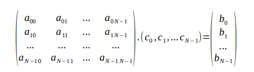

# Computacion Evolutiva

### OBJETIVOS DE APRENDIZAJE
  - [ ] Cómo se diseña e implementa un algoritmo genético (usando Ruby).
  - [ ] Cómo se usa un algoritmo genético para resolver un problema.
  - [ ] Cómo se verifica si un algoritmo genético funciona correctamente (por medio de Cucumber).
  - [ ] Cómo se hace una pequeña investigación cambiando parámetros del problema y comparando resultados.
  - [ ] Trabajo en equipo.

### PROBLEMA A RESOLVER
El trabajo consiste en escribir un algoritmo genético (GA) en paradigma OO y lenguaje Ruby,
siguiendo una metodología de desarrollo ágil basada en pruebas (Cucumber), y aplicarlo para resolver
un problema fácil parametrizado según el tamaño del problema N. Concretamente hay que resolver un
sistema de N ecuaciones y N incógnitas: Ac = B
 
 

A partir de unos valores concretos de A y B, el algoritmo genético debe encontrar el vector c que los
satisfaga. Es decir, c es el cromosoma.
Los valores de A conviene generarlos al azar. Y luego crear también al azar un vector solución s. Por
último, calcular el vector B = As. De este modo nosotros conocemos la solución s, pero el algoritmo
genético tiene que descubrirla.

